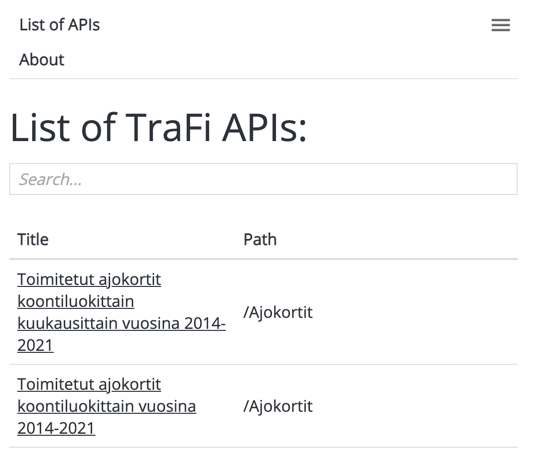

# Traficom API react frontend

## What is this?

This project is a simple react frontend for Traficom open APIs.

The Finnish Transport and Communications Agency Traficom is an authority in permit, licence, registration, approval, safety and security matters in Finland.


## Available Scripts

In the project directory, you can run:

### `npm start`

Runs the app in the development mode.\
Open [http://localhost:3000](http://localhost:3000) to view it in the browser.

The page will reload if you make edits.\
You will also see any lint errors in the console.

### `npm run build`

Builds the app for production to the `build` folder.

After this you can serve the built version by:
```serve -s build```

See the section about [deployment](https://facebook.github.io/create-react-app/docs/deployment) for more information.


## Example pictures




